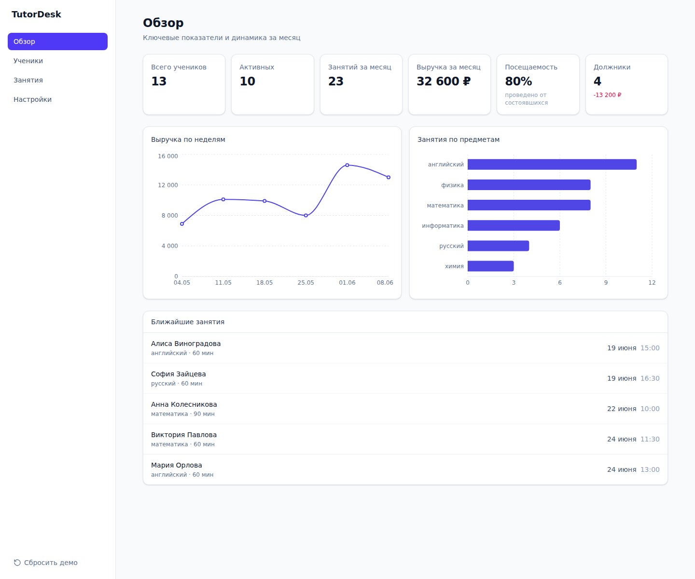
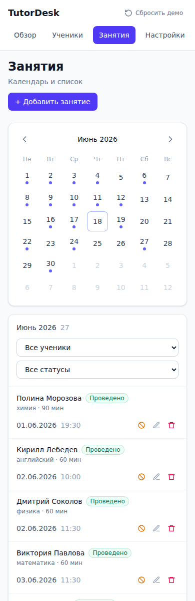
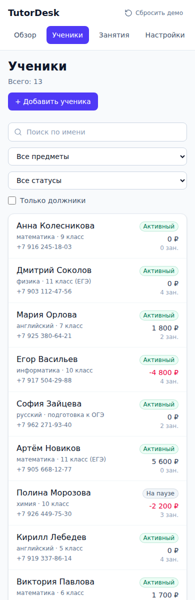

# TutorDesk — кабинет для частного бизнеса

[](https://tutordesk-two.vercel.app)
[](#для-разработчика)

**Готовый рабочий кабинет для тех, кто ведёт клиентов вручную: репетитор,
мастер бьюти, фитнес-тренер.** Ученики/клиенты, расписание, оплаты и баланс,
наглядная аналитика — в одном окне, без таблиц в тетради и хаоса в переписке.

🔗 **Живое демо:** https://tutordesk-two.vercel.app

📌 **Portfolio case:** [docs/portfolio-case.md](docs/portfolio-case.md)

## Demo screenshots



| Mobile schedule / records | Mobile clients / CRM |
|---|---|
|  |  |

## Что внутри

- **Обзор** — ключевые цифры за месяц (клиенты, выручка, посещаемость,
  **должники** одним кликом), график выручки по неделям, разбивка по услугам,
  ближайшие записи.
- **Клиенты** — поиск, фильтры, фильтр «только должники», баланс с подсветкой
  долга, карточка с историей визитов и оплат, добавление / редактирование /
  удаление.
- **Расписание** — месячный календарь, список с фильтрами, добавление и
  изменение записи, отметка «проведено» и отмена — всё отражается сразу.

## Под вашу нишу — за минуту

Раздел **Настройки** переключает профиль бизнеса: **Репетитор · Бьюти ·
Фитнес**. Меняются название, термины (ученики ↔ клиенты, занятия ↔ записи,
предметы ↔ услуги) и демонстрационные данные. Под конкретный бизнес адаптируется
заменой одного конфига — без переписывания логики.

## Что вы получаете

- Адаптивный интерфейс (телефон и десктоп), аккуратный дизайн.
- Статический сайт — дёшево хостить, быстро открывается, работает из РФ.
- Чистый код на актуальном стеке, готовый расширяться (онлайн-запись,
  напоминания, экспорт, личный кабинет клиента).

## Как это продаётся клиенту

TutorDesk — не «коробочная CRM», а быстрый prototype рабочего кабинета под
конкретный бизнес. На его базе можно собрать:

- **Mini CRM Dashboard** — клиенты, записи, статусы, долги, графики;
- **Booking + CRM** — клиентская запись + админка владельца;
- **Service Admin Panel** — внутренний кабинет для услуг и расписания;
- **MVP внутреннего учёта** — замена ручных таблиц и хаоса в переписке.

> Это витринный demo-проект: пример системы, которую можно адаптировать под
> конкретную нишу, подключить к backend, базе данных, авторизации, уведомлениям
> и оплатам.

---

## Для разработчика

SPA без бэкенда, авторизации и оплаты. Данные — детерминированные моки в памяти,
сбрасываются при перезагрузке (кнопка «Сбросить демо» — тоже).

### Стек
- [Vite](https://vite.dev/) + React (JavaScript)
- Tailwind CSS v4 — плагин `@tailwindcss/vite` (без `tailwind.config.js` и PostCSS;
  в `src/index.css` только `@import "tailwindcss";`)
- [react-router-dom](https://reactrouter.com/) — declarative режим
- [Recharts](https://recharts.org/) — графики
- Состояние — React Context; ниши и данные — `src/data/config.js` + `src/data/generate.js`

### Команды
```bash
npm install      # установка зависимостей
npm run dev      # дев-сервер (http://localhost:5173)
npm run build    # продакшен-сборка в dist/
npm run preview  # локальный просмотр собранной версии
```

### Структура
```
src/
  data/        config.js (профили ниш) + generate.js (генератор датасета)
  lib/         форматирование, даты, селекторы (KPI, выручка, должники)
  components/  переиспользуемый UI (StatCard, Badge, Modal, Toast, ...)
  context/     Config / Toast / Data — состояние приложения
  pages/       Overview, Students, Lessons, Settings
  layouts/     AppLayout (меню + контент)
  index.css    @import "tailwindcss";
```

### Деплой

Развёрнут на **Vercel** (production): https://tutordesk-two.vercel.app
Vercel-проект связан с этим репозиторием — каждый `git push` в `main`
автоматически пересобирает и обновляет прод.

Разовый деплой из консоли:
```bash
npm i -g vercel
vercel --prod
```

Файл `vercel.json` (`rewrites` → `/index.html`) обязателен для Vercel — иначе
прямое открытие `/students` или `/lessons` вернёт 404 (клиентский SPA-роутинг).

<details>
<summary>Альтернатива — Cloudflare Pages</summary>

Connect to Git → preset `Vite`, build `npm run build`, output `dist`.
SPA-фоллбэк уже лежит в `public/_redirects` (`/* /index.html 200`).
</details>

## Примечание

Все данные (имена, телефоны, суммы) вымышлены и созданы для демонстрации
интерфейса. Бэкенда и сохранения нет — изменения живут до перезагрузки страницы.
